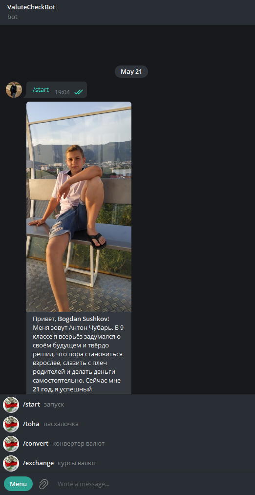

# ValutaTelegramBot
### __Installing__ 
 Bot works with variables from virtual environment. So to start bot working, you firstly need to set your __apikey__:

 ```sh
 export API_KEY=<your_api>
 ```
You can run code with ```two variants```:
1. Via .py file:
- *Bot works with variables from virtual environment. So to start bot working, you firstly need to set your __apikey__*:
 ```sh
 $ export API_KEY=<your_api>
 ```
- *and then run:*
```sh
$ pytnon3 value.py
```
 2. Via docker-file:   
```sh
$ sudo docker build -t valuta .
$ sudo docker run -e API_KEY=<api_key> valuta
```
Этот бот создан для того, чтобы получать актуальную информацию о курсах валют на торговой бирже. У бота есть несколько команд:
> ```/convert``` - запуск конвертера
> ```/exchange``` - запуск сценария получения информации о курсах валют

и несколько других. Посмотреть их описание можно с помощью внутреннего меню в диалоге с ботом. Есть обработчик обычных текстовых сообщений.
Затестить бота можно, обратившись к `@GtbdsBot` в телеграме.

Картинка работающего бота:
